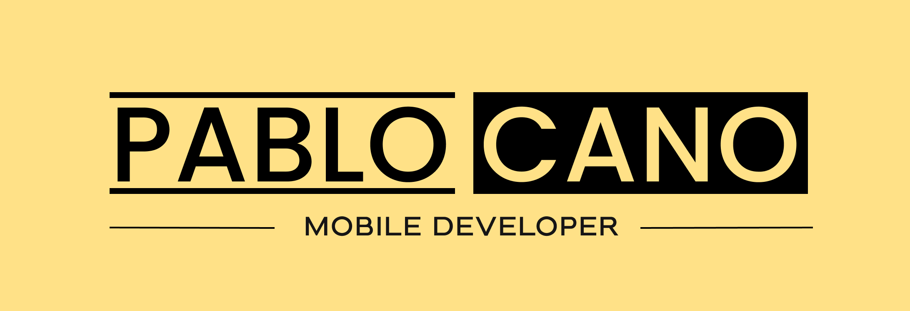

<h1 align="center"> Hi 👀, I'm Pablo Cano </h1>

- 🔭 I’m currently working on [Rally Transbetxí](https://github.com/xicotet/RallyTransbetxi), a mobile application that enhances the experience of the annual motocultor rally in Betxí, Castellón (Spain). This app provides **live timing results** and **real-time race updates**, allowing spectators to stay connected with all the action happening on the track.

- 🤝 I'm looking for help with [ZonaBlava](https://github.com/xicotet/ZonaBlava), a cutting-edge Android app that streamlines regulated parking management by enabling users to **effortlessly acquire virtual parking tickets** on their mobile devices, eliminating the hassle of searching for physical parking meters.

<!-- , witnessing the motocultores' incredible speed and skill firsthand. -->

- 🌱 I’m currently learning **Jetpack Compose** and **cross-platform app development**. 

- 📄 Know about my experiences by reading my [Curriculum Vitae](https://drive.google.com/file/d/1uC3nNBW0tAfj65U8uZ7Rfl0NXmnIu8tM/view?usp=sharing). 
  
- 📫 How to reach me → **contact@pablocano.org**
  
- ⚡ Fun fact → I love endurance running races like marathons or half marathons. 

## Connect with me:

## Languages and Tools:</h3>

               

&nbsp;

